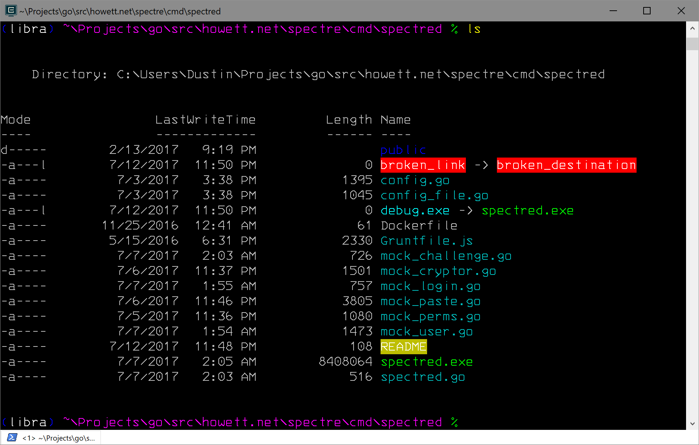
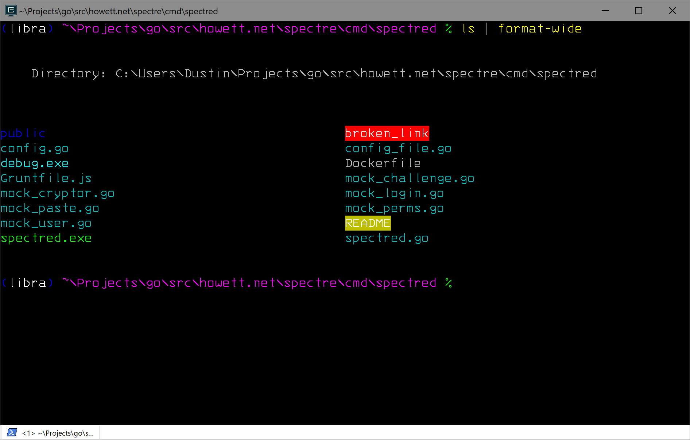
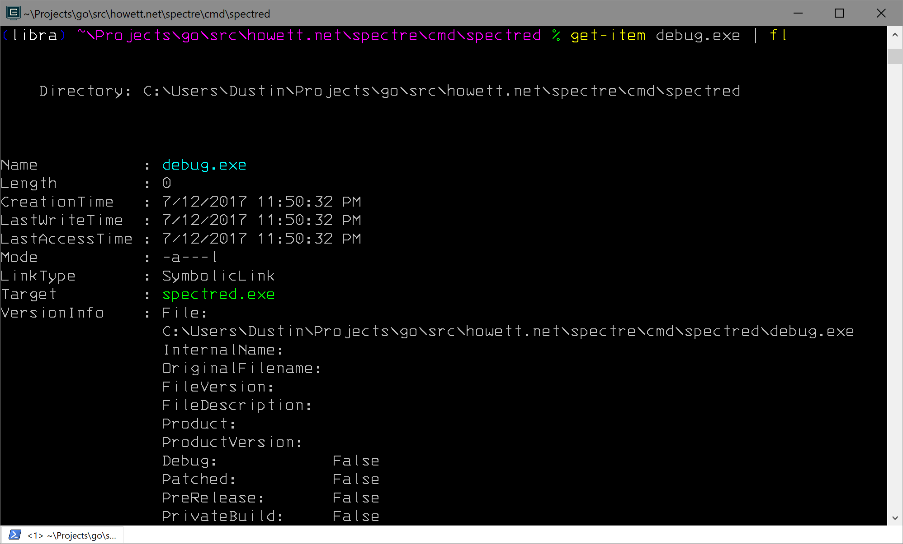

# DirColors

DirColors leverages Powershell's custom formatter support to provide an
implementation of GNU coreutils' `ls --color=always` anywhere
FileInfo/DirectoryInfo objects are left to self-format.

DirColors adds support for:

* Parsing dircolors-formatted files
* Colorizing filenames in default, table, wide and list-formatted renditions of file information.
* Displaying the targets of symbolic links and directory junction points
* Parsing `LS_COLORS` from your environment
* Storing a dircolors-compatible `LS_COLORS` in your environment for coreutils

For compatibility with existing utilities, DirColors will automatically read `$LS_COLORS` from the
environment when it is loaded and write back to it when the color scheme is updated.

## Usage

Assuming you've installed the module somewhere in your module path, just import the module in your profile and load a dircolors file.

```powershell
Import-Module DirColors

# Load a color scheme
Update-DirColors ~\dir_colors
```

## Screenshots






